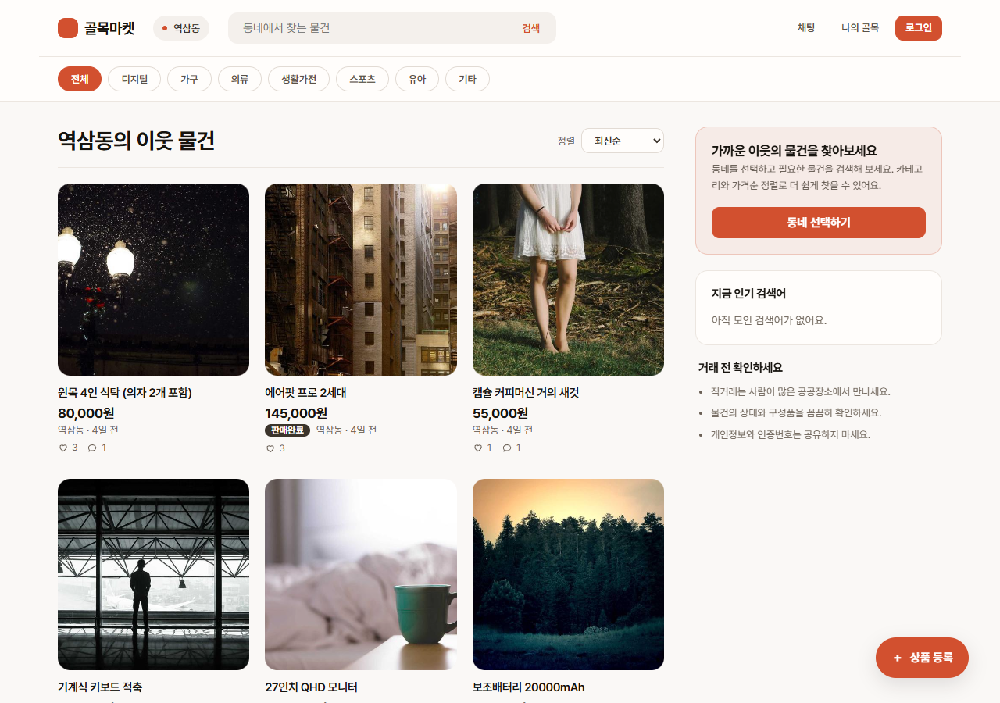
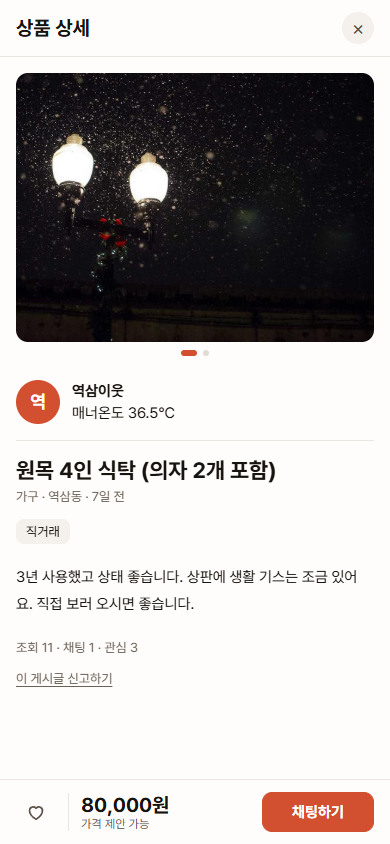
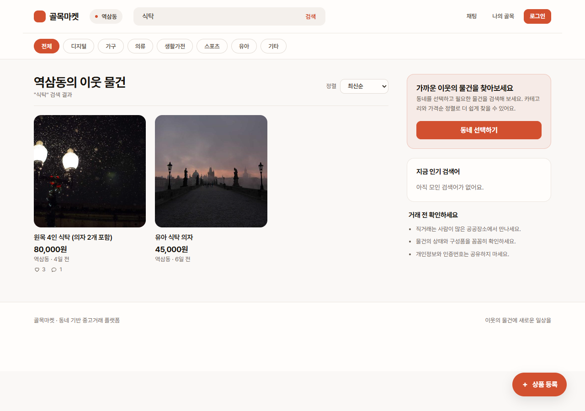
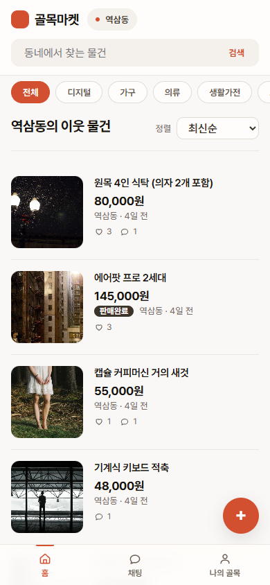

# 골목마켓 (Golmok Market)

동네 기반 중고거래 서비스의 백엔드입니다. **실시간 채팅 · 알림 · 동시성 제어**를 중심에 두고 혼자 만들었습니다.

- **프론트엔드 저장소:** [golmok-market-frontend](https://github.com/leejiseong20/golmok-market-frontend) (React 18 + Vite)
- **데모:** https://golmok-market-frontend.vercel.app — 데모 계정 `demo4@golmok.test` / `Golmok123!`
  > 백엔드는 AWS Academy Learner Lab 에서 돌아갑니다. **랩 세션이 꺼져 있으면 목록이 비어 보입니다.** 보실 시간을 알려 주시면 켜 두겠습니다.

| | |
|---|---|
| 언어·프레임워크 | Java 21, Spring Boot 4.1.1, Spring Security, JPA(Hibernate 7.4) |
| 저장소 | MySQL 8(운영), H2(테스트) · `ddl-auto: validate` |
| 실시간 | STOMP over WebSocket |
| 배포 | GitHub Actions → GHCR 이미지(x86·ARM) → 서버 한 대에 Docker Compose(MySQL · 앱 · Caddy) |
| 테스트 | **501개** (서비스 · API · 동시성 · 실시간 · 암호화 대조) |

---

## 화면

| 홈 (PC) | 상품 상세 (모바일) |
|---|---|
|  |  |

| 검색 | 홈 (모바일) |
|---|---|
|  |  |

---

## 구조

```
브라우저 ─HTTPS→ Vercel (React)
   │                 └ /api/* 를 백엔드로 전달(rewrites)
   └─WebSocket(wss)────────────┐   채팅은 Vercel 을 거치지 못해 백엔드에 직접 붙는다
                               ▼
              서버 한 대 · Docker Compose
                ├ Caddy        80/443, HTTPS 자동 발급
                ├ Spring Boot  외부 노출 없음
                ├ MySQL 8      외부 노출 없음
                └ 업로드 이미지 볼륨
```

기능: 인증(JWT + refresh rotation) · 상품(등록·수정·상태·끌어올리기·커서 페이징) · 이미지 업로드와 썸네일 · 찜 ·
동네 인증(좌표) · 채팅(REST + 실시간) · 채팅방 직거래(예약·취소·거래완료) · 리뷰와 매너온도 · 알림 · 웹 푸시 ·
신고·차단 · 인기 검색어 · 오래된 데이터 정리 배치 · 회원 탈퇴.

API 명세는 [`API-SPEC.md`](API-SPEC.md), 스키마는 [`golmok_schema_v2.sql`](golmok_schema_v2.sql)이 기준입니다.

---

## 이 프로젝트에서 공들인 것

### 1. 동시성 — 돈과 신뢰가 걸린 값은 DB 에서 지킨다

- **카운터(조회수·찜·채팅·매너온도)는 엔티티에서 `++` 하지 않고 원자적 UPDATE 로 올립니다.** 해당 컬럼은 `updatable = false` 로 두어 일반 UPDATE 가 덮어쓰지 못하게 막았습니다.
- **잠금 순서를 상품 → 채팅방 → 거래로 고정**했습니다. 후기는 상품 → 거래 → 회원(id 오름차순), 탈퇴는 판매 상품 → 회원입니다. 방향이 다르면 교착이 납니다.
- **실제 MySQL 에서만 드러난 문제를 고쳤습니다.** 후기 중복 조회가 없는 행에 gap lock 을 걸어 사용자 잠금과 교착했습니다. 리뷰 작성 트랜잭션만 `READ_COMMITTED` 로 낮추고 중복은 상품·거래 잠금 아래에서 확인하도록 바꿨습니다. H2 만으로는 재현되지 않습니다.
- 동시성 테스트는 전용 H2 URL 과 `TransactionTemplate` 로 데이터를 먼저 커밋하고, 스레드를 실제로 띄워 검증합니다.

### 2. 실시간 채팅·알림 — 보내는 길과 받는 길을 나눴다

- **전송은 REST, WebSocket 은 서버 → 클라이언트 푸시 전용**입니다. 검증·에러 형식·잠금이 REST 에 있는데 전송 경로가 둘이면 같은 규칙을 두 번 구현해야 합니다.
- **구독은 개인 큐(`/user/queue/chat`) 하나만 허용하고 클라이언트의 SEND 는 전부 거부**합니다. 방별 채널을 열면 남의 방 번호로 구독하는 것을 막는 검사가 필요하고, 빠뜨리면 대화가 샙니다.
- 인증은 연결 요청이 아니라 **첫 STOMP 프레임(CONNECT)** 에서 합니다. 브라우저 WebSocket 은 헤더를 못 붙이고, URL 쿼리의 토큰은 접속 로그에 남습니다.
- 실시간 전달과 알림 저장은 **커밋 후**(`@TransactionalEventListener`)에 합니다. 알림 저장은 `REQUIRES_NEW` 라 실패해도 원래 동작(찜·거래완료)을 되돌리지 않습니다.

### 3. 웹 푸시 — 라이브러리 없이 RFC 대로 구현

- 본문 암호화 **RFC 8291**(ECDH P-256 → HKDF → AES-128-GCM)과 서버 서명 **RFC 8292**(VAPID, ES256 JWT)를 JDK 만으로 구현했습니다.
- **RFC 부록의 중간값(PRK·IKM·CEK·NONCE)부터 최종 본문까지 바이트 단위로 대조**하는 테스트를 뒀습니다. 암호화는 한 바이트만 틀려도 브라우저가 조용히 버려서 "대충 맞는" 검증이 통하지 않습니다.
- 구독 주소는 **허용 목록으로 걸러 SSRF 를 막습니다**(클라이언트가 준 주소로 서버가 POST 하므로 내부 주소를 두드리게 할 수 있습니다).
- 앱을 보고 있는 사람(WebSocket 연결 중)에게는 보내지 않고, `404·410` 이 오면 구독을 지웁니다.

### 4. 검색 — LIKE 에서 FULLTEXT(ngram)로

- `LIKE '%식탁%'` 은 앞의 `%` 때문에 인덱스를 못 씁니다(EXPLAIN: type ALL). FULLTEXT 불린 모드로 바꿔 `type fulltext` 가 되는 것을 확인했습니다.
- **ngram 파서는 불용어를 포함한 조각을 통째로 버립니다.** 영어 `a`·`i` 때문에 `ipad`·`air` 검색이 실패했고, 불용어를 끄고 인덱스를 다시 만들어 해결했습니다. 설정은 인덱스를 만드는 순간 고정되고, 한 ALTER 문 안에서 지우고 다시 만들면 예전 설정이 남습니다.
- 검색어는 **바인딩 변수로** 넘깁니다. 처음에는 `cb.literal()` 을 썼는데 Hibernate 7 이 SQL 에 그대로 적어 넣었습니다(운영 로그로 발견). H2 로는 드러나지 않습니다.

### 5. 보안

- 비밀번호는 BCrypt, refresh token 은 무작위 문자열이고 **DB 에는 SHA-256 해시만** 저장합니다. 재발급은 `SELECT ... FOR UPDATE` 로 한 줄로 세워 동시 재발급으로 한쪽 토큰이 조용히 무효가 되는 것을 막습니다.
- **로그인 실패 횟수 제한**: 같은 이메일 5회·같은 IP 20회(10분)면 429 로 막고, 잠긴 동안에는 맞는 비밀번호도 막습니다.
- 401 을 `EXPIRED_TOKEN` 과 `INVALID_TOKEN` 으로 나눠, 프론트가 "재발급"과 "즉시 로그아웃"을 구분할 수 있게 했습니다.
- 차단은 한 방향으로 기록하고 판단은 양방향으로 합니다. **차단당한 쪽에는 차단 사실이 드러나지 않도록 문구를 방향별로 나눴습니다**(프론트를 붙이다 발견해 고쳤습니다).

---

## 검증 방식

- **보호 장치를 일부러 빼서 테스트가 실패하는지 확인한 뒤 되돌립니다.** 잠금, 캐시, UNIQUE 변환, 차단 필터, SSRF 허용 목록 모두 이 방식으로 확인했습니다.
- 알림 차단 테스트가 한동안 **헛돌던 것**을 발견해 고쳤습니다. 알림은 커밋 뒤에 만들어지는데 롤백 트랜잭션 테스트에서는 필터를 꺼도 통과했습니다. 커밋하는 전용 테스트로 옮겼습니다.
- H2 로 끝내지 않고 **실제 MySQL·실제 브라우저**로 확인합니다. 상품 쓰기와 후기 흐름은 Playwright 로 실제 서버에 붙여 돌립니다.

```bash
./gradlew test    # 501개, H2 라 DB 없이 돈다
./gradlew bootRun # 로컬 MySQL 필요 (DB_PASSWORD · JWT_SECRET 환경변수)
```

---

## 알려진 한계 (의도한 선택 포함)

- **서버 한 대**입니다. WebSocket 브로커·인기 검색어 캐시·로그인 실패 기록이 모두 메모리라, 서버를 늘리면 Redis 같은 공용 저장소가 필요합니다.
- **결제는 범위에서 뺐습니다**(동네 직거래가 핵심 흐름). `payments` 테이블과 `PAID`·`SHIPPING` 상태는 확장 설계로 남겨 뒀습니다.
- 업로드 이미지가 **서버 디스크 볼륨**에 있습니다. 오브젝트 스토리지 이전과 고아 파일 정리 배치는 후속 과제입니다.
- 신고를 받아만 두고 **운영자 화면이 없습니다**. 쌓인 신고는 DB 로 봅니다.
- 로그아웃·탈퇴 뒤에도 access token 은 만료(최대 30분)까지 유효합니다. 막으려면 요청마다 블랙리스트 조회가 필요해 JWT 의 이점이 사라집니다.

더 자세한 설계 근거와 진행 기록은 [`CLAUDE.md`](CLAUDE.md)에 날짜별로 남겨 두었습니다.
